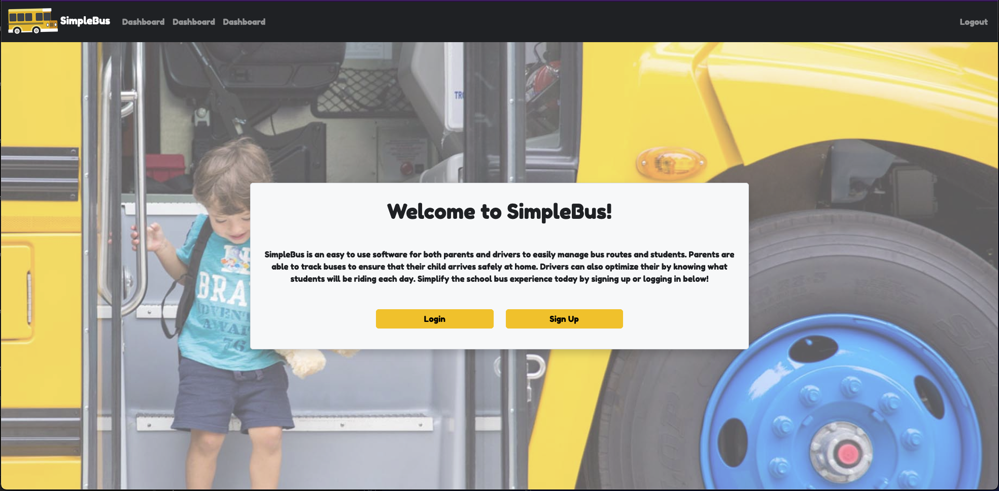

# SimpleBus

SimpleBus is an application designed to simplify and secure school bus route management.  SimpleBus allows administrators, drivers, and parents to easily access information about routes and students as well as manage those systems.  Administrators and Drivers can enjoy the simplicity of managing there routes easily and Parents can have the piece of mind knowing where there student is at all times.

## Technology Stack

- MySQL Database
- Spring Data JPA
- Spring MVC
- Google Maps API
- Java
- JSP
- Bootstrap
- JavaScript

## Key Features

The site is broken down into 3 different use cases: Administrator, Parent, and Driver

- Administrators
    - Create new routes and stops
    - Reset all routes for the next day

- Parent
    - View their students individual route status
    - See Students information
    - Change riding status for students

- Drivers
    - See what routes they are assigned
    - Go through route experience while driving to ensure all students are accounted for

## Views

Welcome Page

## Built With

  - [Contributor Covenant](https://www.contributor-covenant.org/) - Used
    for the Code of Conduct
  - [Creative Commons](https://creativecommons.org/) - Used to choose
    the license

## Contributing

Please read [CONTRIBUTING.md](CONTRIBUTING.md) for details on our code
of conduct, and the process for submitting pull requests to us.

## Versioning

We use [Semantic Versioning](http://semver.org/) for versioning. For the versions
available, see the [tags on this
repository](https://github.com/PurpleBooth/a-good-readme-template/tags).

## Authors

  - **Billie Thompson** - *Provided README Template* -
    [PurpleBooth](https://github.com/PurpleBooth)

See also the list of
[contributors](https://github.com/PurpleBooth/a-good-readme-template/contributors)
who participated in this project.

## License

This project is licensed under the [CC0 1.0 Universal](LICENSE.md)
Creative Commons License - see the [LICENSE.md](LICENSE.md) file for
details

## Acknowledgments

  - Hat tip to anyone whose code is used
  - Inspiration
  - etc
